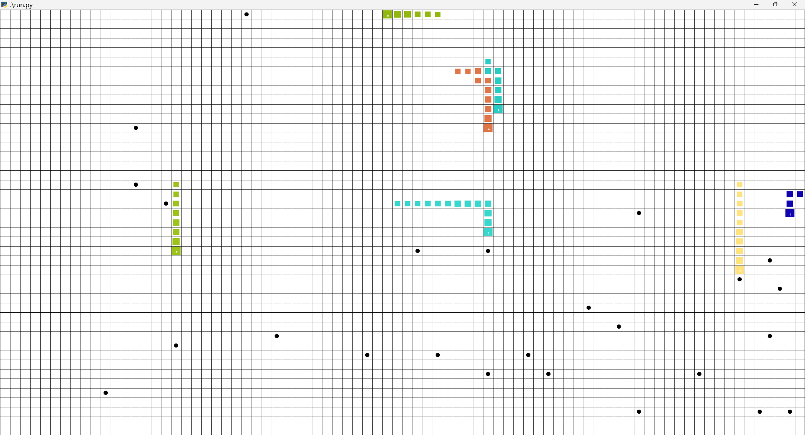
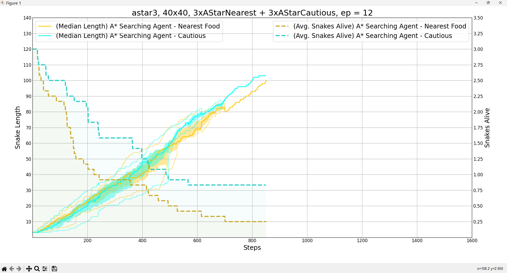

# Autonomous Agents & Multi-Agent Systems

## Group 38
- Simão Paiva, 93615
- David Duque, 93698

# Before we begin

## (Recommended) using anaconda/miniconda

1. Create an environment just for this project (no need to mess with dependency pinning)

```
conda env create -f conda_environment.yml
```

2. Activate the environment:
```
conda activate snake
```

3. Test everything is OK
```
python ./run.py --scenario randoms -r
```

## "Manual" Installation

This may need some tinkering with dependency pinning. You're on your own here.

1. (Recommended) Create virtual environment
```
$ python3 -m venv venv
$ source venv/bin/activate
```

...or if you're on Windows:

```
python -m venv venv
./venv/Scripts/activate.bat
```

2. Install dependencies
```
pip install -r requirements.txt
```

3. Test everything is OK
```
python ./run.py --scenario randoms -r
```

And you're ready to go!

# Quick Start
This project runs on "scenarios", which are configurations for a certain environment (a different set of agents, a different grid configuration, etc.). We've already prepared some for you to run.

You can create your own scenarios by editing the `config.py` file, here's a template!

```py
"scenario_name": {
    "output": "default_name.json",
    "agents": [
        YourAgentHereA(),
        YourAgentHereA(),
        YourAgentHereA(),
        YourAgentHereA(),
        YourAgentHereB(),
        YourAgentHereB(),
        YourAgentHereB(),
        YourAgentHereB()
    ],
    "grid": (50, 50)
}
```

## Running the environment

```
python ./run.py --scenario SCENARIO [-n EPISODES=1] [-e [EXPORT]] [-r] [-p PROCESSES=1]
```

- `--scenario` - The name of the scenario to run (as configured in `config.py`)
- `-n`, `--episodes` - How many instances of this scenario to simulate?
- `-e`, `--export` - Record the simulation results. Optionally provide a file where to save them to.
- `-r`, `--render` - Render the simulation to screen (takes longer to complete, not recommended if you're running a lot of episodes)
- `-p`, `--processes` - Split the workload among multiple processes. Simulation data is then joined at the end and written to one file (if applicable).



## Plotting the performance of agents

If you used the `--export` option previously, you probably now have a json dump file. You can run

```
python ./plot.py simulation_output.json
```

To obtain a plot of the performance of your agents for that (or those) simulation(s).

